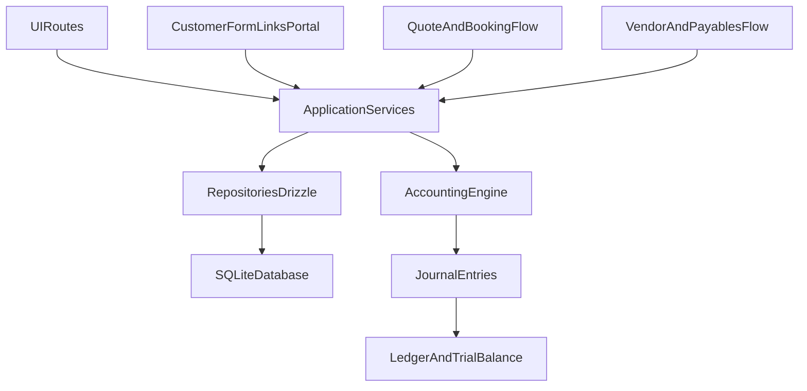

# Meridian Full MVP Plan

## Product Scope Confirmed
- Full-suite MVP in the first implementation cycle: user management, CRM, customer family management, group management, booking type/service management (Flight, Train, Visa, etc.), booking management, vendors, quotes, customer self-fill forms, and accounting.
- Deployment model: single agency now, with schema/service boundaries that make future multi-tenant migration straightforward.

## Existing Baseline (already in repo)
- App shell and routing exist via TanStack Start and file-based router in [`/Users/naresh/Projects/meridian/src/routes/__root.tsx`](/Users/naresh/Projects/meridian/src/routes/__root.tsx), [`/Users/naresh/Projects/meridian/src/routes/index.tsx`](/Users/naresh/Projects/meridian/src/routes/index.tsx), [`/Users/naresh/Projects/meridian/src/router.tsx`](/Users/naresh/Projects/meridian/src/router.tsx), and [`/Users/naresh/Projects/meridian/src/routeTree.gen.ts`](/Users/naresh/Projects/meridian/src/routeTree.gen.ts).
- shadcn setup exists in [`/Users/naresh/Projects/meridian/components.json`](/Users/naresh/Projects/meridian/components.json) and base UI styles in [`/Users/naresh/Projects/meridian/src/styles.css`](/Users/naresh/Projects/meridian/src/styles.css).
- No ORM/database/business modules yet.

## Architecture Direction
- Use Drizzle ORM + SQLite for transactional core.
- Keep domain logic in service modules, not route files, so migration to Postgres/multi-tenant is mostly infra/schema work later.
- Use server-side route handlers/server functions for writes, typed loaders for reads.
- Use Zod for validation and form DTO contracts.
- Route architecture:
  - All authenticated backoffice UI lives under `/app/*`.
  - Public/customer-facing routes remain outside `/app/*` (for example customer form submission links and auth activation/reset pages).
  - `/app/*` is guarded by session + permission checks at layout level.



## Core Data Model (MVP)
- Identity and org scaffold: `agencies`, `users`, `roles`, `permissions`, `role_permissions`, `user_roles`, `user_invites`, `user_sessions` (single agency default row; add nullable/future `agency_id` references across entities now).
- CRM: `customers`, `customer_contacts`, `customer_notes`, `customer_documents`.
- Customer families: `customer_families`, `customer_family_members` (many-to-many between families and customers with role metadata like head/spouse/child/other).
- Groups and trips: `travel_groups`, `group_members`, `itineraries`.
- Booking service catalog: `booking_services` (master list: Flight, Train, Visa, Hotel, Insurance, etc.), `booking_service_rules` (optional defaults for fulfillment/account mappings).
- Sales flow: `quotes`, `quote_items`, `quote_versions`, `quote_acceptance_events`.
- Booking ops: `bookings`, `booking_items`, `booking_status_history`, `booking_travelers` (each booking/booking item tied to a `booking_service_id`).
- Vendors and obligations: `vendors`, `vendor_contacts`, `vendor_bills`, `vendor_bill_items`, `vendor_payments`.
- Customer forms via links: `form_templates`, `form_requests`, `form_submissions`, `form_submission_audit`.
- Double-entry accounting: `accounts`, `journal_batches`, `journal_entries`, `journal_lines`, `posting_sources`.

## Accounting Rules (non-negotiable MVP invariants)
- Every posted transaction must have at least 2 journal lines.
- Sum(debits) = Sum(credits) for each journal entry.
- No direct ledger edits after posting; corrections via reversal and replacement entries.
- Operational modules (quotes/bookings/vendor bills/payments) generate postings through a single posting service.
- Minimum reports in MVP: Trial Balance, General Ledger, Accounts Receivable summary, Accounts Payable summary.

## Implementation Phases

### Phase 1: Platform and project structure
- Add dependencies and setup: Drizzle, SQLite driver, Zod, React Hook Form.
- Add authentication/session base and guarded route scaffolding for internal app users.
- Introduce an `/app/*` layout route as the unified shell for internal UI navigation.
- Build public-facing landing homepage and login UI with parallax + shader effects (performance budgeted and progressively enhanced).
- Create folders for domain-first structure:
  - `src/server/db/` (database client, schema, migrations)
  - `src/server/services/` (auth, user management, CRM, booking, quote, vendor, accounting services)
  - `src/server/repositories/` (Drizzle data access)
  - `src/features/` (UI modules by domain)
- Add app layout and navigation shell replacing placeholder home.

### Phase 2: Database schema + migration baseline
- Create Drizzle config and initial migration set.
- Implement schema in cohesive modules (auth/users, crm, customer families, booking services, booking, quotes, vendors, accounting).
- Seed reference data: chart of account templates, booking statuses, quote statuses, default booking service catalog (Flight/Train/Visa + extensible list).
- Add DB constraints/indexes for accounting integrity and fast lookups.

### Phase 3: User Management + CRM + Customer Family + Group management
- Build internal user management admin:
  - User list/detail screens
  - Invite user flow (email/token-based activation link pattern)
  - Activate/deactivate user controls
  - Assign/remove roles per user
- Build Customers list/detail/create/edit and contact management.
- Build Customer Families list/detail/create/edit and member assignment from customer records.
- Build Groups list/detail and group member assignment from customers.
- Add basic search/filter across users, customers, families, and groups.

### Phase 4: Quotes + Bookings
- Build booking service/type admin (CRUD for Flight/Train/Visa/etc.) with active/inactive controls.
- Build quote creation with line items and versioning.
- Ensure each quote item selects a booking service/type.
- Add quote accept/decline and conversion path quote -> booking.
- Build booking lifecycle tracking and traveler assignment, preserving service/type at item level.
- Record booking events for audit trail.

### Phase 5: Vendors + payables
- Vendor CRUD and contact management.
- Vendor bill creation and status flow.
- Vendor payment recording with linkage to bills.

### Phase 6: Customer self-fill forms via secure links
- Build form template builder (MVP scope: fixed component set).
- Generate expiring tokenized form request links tied to customer/booking/quote context.
- Build public submission page and write-once submission storage.
- Add internal review screen to approve/reject submitted data before applying updates.

### Phase 7: Double-entry accounting engine
- Implement account catalog and posting service.
- Map business events to postings:
  - Booking confirmation (receivable/revenue)
  - Vendor bill (expense/payable)
  - Customer payment (cash/receivable)
  - Vendor payment (payable/cash)
- Allow optional service-type-level default account mappings (for example Visa -> visa processing revenue account), with manual override at transaction time.
- Implement posting, reversal, and reposting workflow.

### Phase 8: Accounting views and reports
- Journal explorer with source-document drilldown.
- General ledger by account/date range.
- Trial balance with validation banner (must net to zero).
- AR/AP summaries linked to customer/vendor records.

### Phase 9: Hardening and release readiness
- Role-based access and permission enforcement across all modules (admin, operations, accountant, sales).
- Input validation and server-side authorization checks across all write paths.
- End-to-end smoke tests for key lifecycles (quote->booking->invoice-like postings and vendor bill->payment).
- Backup/export strategy for SQLite and first-production deployment checklist.

## Concrete File Plan (initial critical files)
- Modify app/routing foundation:
  - [`/Users/naresh/Projects/meridian/src/routes/__root.tsx`](/Users/naresh/Projects/meridian/src/routes/__root.tsx)
  - [`/Users/naresh/Projects/meridian/src/routes/index.tsx`](/Users/naresh/Projects/meridian/src/routes/index.tsx)
  - [`/Users/naresh/Projects/meridian/src/routes/app/route.tsx`](/Users/naresh/Projects/meridian/src/routes/app/route.tsx)
- Add data layer:
  - [`/Users/naresh/Projects/meridian/drizzle.config.ts`](/Users/naresh/Projects/meridian/drizzle.config.ts)
  - [`/Users/naresh/Projects/meridian/src/server/db/client.ts`](/Users/naresh/Projects/meridian/src/server/db/client.ts)
  - [`/Users/naresh/Projects/meridian/src/server/db/schema/*.ts`](/Users/naresh/Projects/meridian/src/server/db/schema/*.ts)
  - [`/Users/naresh/Projects/meridian/src/server/db/migrations/*`](/Users/naresh/Projects/meridian/src/server/db/migrations/*)
- Add domain services:
  - [`/Users/naresh/Projects/meridian/src/server/services/auth/*.ts`](/Users/naresh/Projects/meridian/src/server/services/auth/*.ts)
  - [`/Users/naresh/Projects/meridian/src/server/services/users/*.ts`](/Users/naresh/Projects/meridian/src/server/services/users/*.ts)
  - [`/Users/naresh/Projects/meridian/src/server/services/accounting/*.ts`](/Users/naresh/Projects/meridian/src/server/services/accounting/*.ts)
  - [`/Users/naresh/Projects/meridian/src/server/services/bookings/*.ts`](/Users/naresh/Projects/meridian/src/server/services/bookings/*.ts)
  - [`/Users/naresh/Projects/meridian/src/server/services/booking-services/*.ts`](/Users/naresh/Projects/meridian/src/server/services/booking-services/*.ts)
  - [`/Users/naresh/Projects/meridian/src/server/services/quotes/*.ts`](/Users/naresh/Projects/meridian/src/server/services/quotes/*.ts)
  - [`/Users/naresh/Projects/meridian/src/server/services/vendors/*.ts`](/Users/naresh/Projects/meridian/src/server/services/vendors/*.ts)
  - [`/Users/naresh/Projects/meridian/src/server/services/customers/*.ts`](/Users/naresh/Projects/meridian/src/server/services/customers/*.ts)
  - [`/Users/naresh/Projects/meridian/src/server/services/customer-families/*.ts`](/Users/naresh/Projects/meridian/src/server/services/customer-families/*.ts)
- Add feature UIs/routes:
  - [`/Users/naresh/Projects/meridian/src/routes/app/users/*.tsx`](/Users/naresh/Projects/meridian/src/routes/app/users/*.tsx)
  - [`/Users/naresh/Projects/meridian/src/routes/auth/*.tsx`](/Users/naresh/Projects/meridian/src/routes/auth/*.tsx)
  - [`/Users/naresh/Projects/meridian/src/routes/app/customers/*.tsx`](/Users/naresh/Projects/meridian/src/routes/app/customers/*.tsx)
  - [`/Users/naresh/Projects/meridian/src/routes/app/customer-families/*.tsx`](/Users/naresh/Projects/meridian/src/routes/app/customer-families/*.tsx)
  - [`/Users/naresh/Projects/meridian/src/routes/app/groups/*.tsx`](/Users/naresh/Projects/meridian/src/routes/app/groups/*.tsx)
  - [`/Users/naresh/Projects/meridian/src/routes/app/booking-services/*.tsx`](/Users/naresh/Projects/meridian/src/routes/app/booking-services/*.tsx)
  - [`/Users/naresh/Projects/meridian/src/routes/app/quotes/*.tsx`](/Users/naresh/Projects/meridian/src/routes/app/quotes/*.tsx)
  - [`/Users/naresh/Projects/meridian/src/routes/app/bookings/*.tsx`](/Users/naresh/Projects/meridian/src/routes/app/bookings/*.tsx)
  - [`/Users/naresh/Projects/meridian/src/routes/app/vendors/*.tsx`](/Users/naresh/Projects/meridian/src/routes/app/vendors/*.tsx)
  - [`/Users/naresh/Projects/meridian/src/routes/app/accounting/*.tsx`](/Users/naresh/Projects/meridian/src/routes/app/accounting/*.tsx)
  - [`/Users/naresh/Projects/meridian/src/routes/forms/*.tsx`](/Users/naresh/Projects/meridian/src/routes/forms/*.tsx)

## Verification Strategy
- Unit tests for accounting invariants and posting maps.
- Integration tests for DB-backed workflows (quote->booking, vendor bill->payment).
- UI tests for core operator journeys (customer onboarding, quote send, booking update, form review).
- Financial correctness checks with deterministic fixture scenarios and expected trial balance outputs.

## Delivery Milestones
- Milestone 0: Public homepage + login UX shipped with parallax and shader effects (with graceful fallback for low-end devices).
- Milestone A: Auth/User Management + CRM + Customer Families + Groups + base schema live.
- Milestone B: Booking Services + Quotes + Bookings + Vendors live with no accounting postings.
- Milestone C: Accounting engine connected to business events.
- Milestone D: Reports + customer form links + release hardening.

## Key Decisions Locked
- SQLite + Drizzle for MVP.
- Full-suite MVP in first cycle (not split into separate product waves).
- Single-tenant now with future-ready schema boundaries (agency-scoped columns + service boundaries).

## Parallel Subagent Execution Plan

### Execution Objective
- Run independent modules in parallel using multiple subagents while minimizing merge conflicts and preserving accounting/data integrity.
- Use a two-speed model:
  - **Track A (Foundation first):** shared contracts and infrastructure.
  - **Track B (Feature parallel):** domain modules built concurrently once contracts are frozen.

### Dependency Gates
- **Gate 0 (must finish first):** route shell + auth/session skeleton + Drizzle base + initial schema contracts.
- **Gate 1 (parallel start):** feature subagents begin once DB schema modules and core DTO contracts are approved.
- **Gate 2 (integration):** accounting posting integration starts once quote/booking/vendor event contracts are stable.
- **Gate 3 (release hardening):** cross-module QA and RBAC verification after all feature tracks merge.

### Subagent Workstreams (can run in parallel)
- **Workstream 0 - Public experience (Homepage + Login visuals):**
  - Scope: build `/` homepage and `/auth/login` with parallax sections and shader-backed hero/background effects.
  - Primary files: `src/routes/index.tsx`, `src/routes/auth/login.tsx`, `src/components/*` for visual sections/effects, optional shader utility modules.
  - Depends on: minimal shared UI conventions from Workstream 1; can begin early in parallel.

- **Workstream 1 - Foundation and contracts (blocking first):**
  - Scope: `/app/*` shell, auth/session guard, base DB client, schema folder structure, shared Zod DTOs, permission primitives.
  - Primary files: `src/routes/app/route.tsx`, `src/server/db/*`, `src/server/services/auth/*`, shared type/validation modules.
  - Deliverable: stable interfaces that other subagents consume.

- **Workstream 2 - User management + RBAC:**
  - Scope: users, roles, permissions, invite/activation, user admin UI.
  - Primary files: `src/routes/app/users/*`, `src/routes/auth/*`, `src/server/services/users/*`.
  - Depends on: Workstream 1.

- **Workstream 3 - CRM core (customers, families, groups):**
  - Scope: customer CRUD, customer families, groups, membership assignment, list/search/filter UX.
  - Primary files: `src/routes/app/customers/*`, `src/routes/app/customer-families/*`, `src/routes/app/groups/*`, related services/repos.
  - Depends on: Workstream 1.

- **Workstream 4 - Quote + booking + booking services:**
  - Scope: booking service master data, quote lifecycle, quote->booking conversion, booking lifecycle/travelers.
  - Primary files: `src/routes/app/booking-services/*`, `src/routes/app/quotes/*`, `src/routes/app/bookings/*`, related services/repos.
  - Depends on: Workstream 1.

- **Workstream 5 - Vendors + payables:**
  - Scope: vendor CRUD, bills, bill items, payments.
  - Primary files: `src/routes/app/vendors/*`, `src/server/services/vendors/*`, related repos/schema slices.
  - Depends on: Workstream 1.

- **Workstream 6 - Customer form links portal:**
  - Scope: template/request/submission flow, secure public link pages, internal review UI.
  - Primary files: `src/routes/forms/*`, supporting internal routes under `/app/*`, form services/repos.
  - Depends on: Workstream 1 and CRM entity contracts.

- **Workstream 7 - Accounting engine + reports (partially parallel):**
  - Scope: posting engine, journal/ledger/trial balance, AR/AP summaries, source-document drilldowns.
  - Primary files: `src/server/services/accounting/*`, `src/routes/app/accounting/*`, accounting schema/repos.
  - Depends on: Workstream 1 for base; integrates with Workstreams 4 and 5 at Gate 2.

- **Workstream 8 - QA and integration harness:**
  - Scope: shared fixtures, integration tests, end-to-end smoke flows, regression checks after merges.
  - Primary files: test directories for service and route flows.
  - Runs continuously; final pass after Gate 3.

### File Ownership Rules (to avoid conflicts)
- One subagent owns each top-level domain directory at a time.
- Shared files are edited only by Foundation owner unless explicitly handed off:
  - `src/routes/__root.tsx`
  - `src/routes/app/route.tsx`
  - `src/server/db/client.ts`
  - shared schema index/export files
  - shared validation/type modules
- Subagents avoid editing other domains' route trees directly; integration owner reconciles route registrations if needed.

### Contract-First Handoff Format
- Before coding, each workstream publishes:
  - DB tables/columns it needs
  - service function signatures
  - route paths and loader/action contracts
  - permission keys required
- After approval, contracts are treated as frozen for that checkpoint window.

### Merge and Review Cadence
- **Step 1:** Foundation merges first (Gate 0).
- **Step 2:** Parallel feature workstreams merge in small increments behind passing tests.
- **Step 3:** Accounting integration merge at Gate 2 after event contract verification.
- **Step 4:** QA/hardening sweep and RBAC audit before release signoff.

### Suggested Subagent Batch Launch Order
- **Batch A (sequential):** Workstream 1.
- **Batch B (parallel):** Workstreams 0, 2, 3, 4, 5.
- **Batch C (parallel after partial B):** Workstreams 6 and 7.
- **Batch D (final):** Workstream 8 full regression + release hardening.

### Subagent Dispatch Prompt Pack (copy/paste)
- **Prompt for Workstream 0 - Public experience (Homepage + Login):**
  - "Implement Meridian public experience routes with strong visual polish. Scope: `src/routes/index.tsx` and `src/routes/auth/login.tsx` plus any isolated UI components/utilities needed. Visual direction: take structural inspiration from Stripe-style storytelling sections (premium SaaS narrative flow) while keeping Meridian-specific branding, copy, and component composition. Reuse/adapt Aceternity-style components for parallax and animated sections where appropriate. Requirements: parallax scrolling sections on homepage, shader-based animated hero/background (GPU-safe, with fallback for reduced-motion and low-power devices), responsive design, accessibility contrast checks, and no coupling to `/app/*` internals. Keep auth form logic compatible with existing/future auth service contracts. Return changed files, rationale, component sources used, and performance considerations."

- **Prompt for Workstream 1 - Foundation and contracts:**
  - "Implement Meridian foundation contracts. Scope: `/app/*` layout shell, route guard scaffolding, `src/server/db/client.ts`, Drizzle schema organization, shared DTO/validation modules, and permission primitive definitions. Freeze contracts for downstream teams: table contracts, service signatures, route loader/action shape, and permission keys. Do not implement domain-specific business logic beyond contracts. Return exact contract surface and changed files."

- **Prompt for Workstream 2 - User management + RBAC:**
  - "Build user management and RBAC on top of frozen foundation contracts. Scope: `src/routes/app/users/*`, `src/routes/auth/*` (except visual-only login page if already owned by Workstream 0), `src/server/services/users/*`, plus repository/schema updates limited to user domain. Implement user list/detail, invite/activation flow, activate/deactivate, role assignment, and permission checks. **Read Agent Learnings (Workstream 2) in this plan first** — use `createServerFn` for route loaders/beforeLoad, never import `*.server.*` from routes, idempotent dev seed, SQLite dir creation. Return changed files, key role-permission assumptions, and tests."

- **Prompt for Workstream 3 - CRM core:**
  - "Build CRM modules for customers, customer families, and groups. Scope: `src/routes/app/customers/*`, `src/routes/app/customer-families/*`, `src/routes/app/groups/*`, and matching service/repository/schema slices. Implement CRUD, member assignment, and basic list filtering/search. Respect existing DTO contracts and do not modify unrelated route namespaces. Return changed files and test coverage summary."

- **Prompt for Workstream 4 - Quotes + Bookings + Booking Services:**
  - "Build booking service catalog, quotes, and bookings workflows. Scope: `src/routes/app/booking-services/*`, `src/routes/app/quotes/*`, `src/routes/app/bookings/*`, with related service/repository/schema modules. Implement booking-service CRUD, quote lifecycle with service-typed line items, quote-to-booking conversion, and booking lifecycle tracking. Publish event payload contracts used later by accounting integration. Return changed files and contract notes."

- **Prompt for Workstream 5 - Vendors + Payables:**
  - "Build vendors and payables workflows. Scope: `src/routes/app/vendors/*`, `src/server/services/vendors/*`, plus matching repository/schema slices. Implement vendor CRUD, vendor bill creation/status, and vendor payment recording linked to bills. Publish accounting event contract for payables flows. Return changed files and tests."

- **Prompt for Workstream 6 - Customer form links portal:**
  - "Build secure customer form link workflows. Scope: `src/routes/forms/*` for public submission plus supporting internal routes under `/app/*` for review. Implement template/request/submission lifecycle, expiring tokenized links, write-once storage, and internal approve/reject flow. Integrate with customer/booking/quote entities through service contracts only. Return changed files and security checks."

- **Prompt for Workstream 7 - Accounting engine + reports:**
  - "Build double-entry accounting engine and reports. Scope: `src/server/services/accounting/*`, `src/routes/app/accounting/*`, and accounting schema/repositories. Implement posting service with invariants, reversal/repost workflow, and reports (journal, ledger, trial balance, AR/AP summaries). Integrate with booking/quote/vendor business events after contracts stabilize. Return changed files, invariant enforcement strategy, and financial test fixtures."

- **Prompt for Workstream 8 - QA + integration harness:**
  - "Build integration and quality harness spanning all workstreams. Scope: shared test fixtures, integration tests, smoke flows, and regression checks for auth/RBAC + operational modules + accounting correctness. Add or update test suites without redesigning business logic. Report failing cross-module contracts early. Return changed test files, command list, and pass/fail status."

## Homepage Inspiration and Component Guidance
- Homepage visual strategy for Milestone 0:
  - Use Stripe-style information architecture as inspiration: strong hero, trust/credibility bands, modular feature storytelling, and polished motion hierarchy.
  - Do not copy Stripe brand assets, wording, or layout verbatim; produce original Meridian messaging and composition.
- Component sourcing strategy:
  - Prefer Aceternity components/blocks for parallax sections, animated backgrounds, and shader-friendly visual primitives.
  - Integrate components into Meridian's existing shadcn/Tailwind setup and unify tokens with project theme variables.
- Performance and accessibility guardrails for parallax/shader usage:
  - Respect `prefers-reduced-motion`.
  - Provide static/fallback backgrounds when WebGL/shader path is unavailable or device is low-power.
  - Keep first-load experience lightweight by lazy-loading heavy visual effects and deferring non-critical animations.

## Agent Learnings (Workstream 2 — User Management + Auth)

> Captured from Workstream 2 implementation/debugging (May 2026). **Future agents must read this before touching auth, DB bootstrap, route loaders, or dev seed.**

### Summary

Workstream 2 landed user management + RBAC against frozen contracts. Several runtime failures were **environment and TanStack Start boundary issues**, not business-logic bugs. The fixes are now in repo; this section documents *why* so parallel workstreams do not repeat them.

### Error 1: `Cannot open database because the directory does not exist`

**Symptom:** Login submit appears to do nothing (or throws opaquely). SQLite path is `./data/meridian.sqlite` but `data/` was never created.

**Root cause:** `better-sqlite3` does not create parent directories.

**Fix (required in all environments):**
- In `src/server/db/client.ts`, call `mkdirSync(dirname(path), { recursive: true })` before `new Database(path)`.
- Skip for `:memory:` and `file:` URLs.

**Agent rule:** Never assume `./data/` exists. Do not document "create data folder manually" as the primary workflow.

---

### Error 2: Login button "does nothing"

**Symptoms:** No navigation, no error message.

**Root causes (layered):**
1. DB directory error (Error 1) thrown inside `createServerFn` handler with no client `catch`.
2. Post-login `navigate({ to: redirectTo })` when `redirectTo` was a **full href** (e.g. `http://localhost:3000/app`) from `getRedirectSearch(location.href)` — TanStack Router `to` expects a **path**, not a URL.

**Fixes:**
- Wrap login submit in `try/catch` and surface `error.message` in UI (`src/routes/auth/login.tsx`).
- `getRedirectSearch()` in `src/server/auth/guard.ts` must store **pathname only** (e.g. `/app`), not `location.href`.
- After login, navigate to `redirectTo` only if it starts with `/` and is not `//`; otherwise default to `/app`.

**Agent rule:** All public auth form server actions must show server/validation errors in UI. Never pass full URLs to `navigate({ to })`.

---

### Error 3: `createServerOnlyFn() functions can only be called on the server!`

**Symptom:** After successful login, navigating to `/app` crashes with this error.

**Root cause:** Route `beforeLoad` / `loader` functions in `.tsx` route files run on the **client** during client-side navigation. Calling `createServerOnlyFn()` wrappers (or importing `*.server.ts` modules) from route files triggers TanStack Start import protection / runtime throw.

**Wrong pattern (do not use):**
```ts
// src/routes/app/route.tsx — BAD
beforeLoad: async () => {
  await ensureUserDomainReady() // createServerOnlyFn — throws on client
  return createAppRouteContext(...)
}
```

**Correct pattern (use everywhere DB/session touches route entry):**
- Expose **`createServerFn`** RPC handlers that run server-side only.
- Route `beforeLoad` / `loader` **calls the server fn**, never imports `*.server.*` or `createServerOnlyFn` directly.

**Implemented reference files:**
- `src/server/auth/route-context.ts` → `getAppRouteContextFn` (app layout session + permissions)
- `src/server/services/users/loaders.ts` → `loadUsersIndexFn`, `loadUserDetailFn`
- `src/server/services/users/actions.ts` → `loginFn`, `inviteUserFn`, etc.
- `src/server/auth/bootstrap.impl.server.ts` → real DB migrate/seed/session resolver (server-only impl)

**Agent rule:**
| Layer | Allowed imports |
|-------|-----------------|
| Route `.tsx` (client-safe) | `createServerFn` stubs from non-`.server` modules |
| `createServerFn` handlers | Dynamic import of `*.impl.server.ts`, Drizzle, cookies, `better-sqlite3` |
| Route `.tsx` | **Never** import `**/*.server.*` or call `createServerOnlyFn` |

---

### Error 4: `FOREIGN KEY constraint failed` on `/app` load (dev seed)

**Symptom:** App route blows up during bootstrap/seed on second dev server start or after partial seed.

**Root cause:** Non-idempotent dev seed in `seedAgencyDefaults()`:
- Inserted roles with `onConflictDoNothing()` but kept **new random UUIDs** in memory.
- Inserted `role_permissions` and `user_roles` referencing those UUIDs even when role insert was skipped → FK violation.

**Fix (idempotent seed — required):**
1. **Lookup** existing role by `(agencyId, key)` before insert; use the **actual** row id.
2. Insert only **missing** `role_permissions` (diff against existing).
3. Use `assignRole` with `onConflictDoNothing()` for admin role assignment.
4. Re-running seed must be safe (test: call `ensureDevSeed` twice).

**Recovery for corrupted local DB:**
```bash
rm -f data/meridian.sqlite data/meridian.sqlite-wal data/meridian.sqlite-shm
```
Then restart dev server (seed + migrate run on first request).

**Agent rule:** Any seed using `onConflictDoNothing` must still resolve **existing row IDs** before inserting child FK rows. Add a test that seeds twice.

---

### Error 5: `better-sqlite3` native bindings missing (tests/CI)

**Symptom:** `Could not locate the bindings file` when running Vitest.

**Fix:** After `pnpm install`, native addon may need build:
```bash
cd node_modules/.pnpm/better-sqlite3@*/node_modules/better-sqlite3 && npm run build-release
```
(Exact pnpm path varies; document in README if CI fails.)

**Agent rule:** Prefer `:memory:` SQLite in unit tests via `src/server/services/users/test-helpers.ts`. Migration folder path from test helpers must be `../../db/migrations` (not `../db/migrations`).

---

### Error 6: `createServerFn` return type / serialization

**Symptom:** Typecheck/build failures on action handlers.

**Root cause:** `ServiceError.details?: unknown` is not serializable across the RPC boundary.

**Fix:** Use `RouteServiceError` (`code` + `message` only) in `src/shared/routes/contracts.ts` for all `createServerFn` responses.

**Agent rule:** Server fn handlers return `RouteActionResult<T>`, not raw `ServiceResult` with `details`.

---

### Dev ergonomics ( established conventions )

| Concern | Location | Notes |
|---------|----------|-------|
| Dev admin credentials | `src/shared/dev/credentials.ts` | `admin@meridian.example` / `change-me-now`; synced with `ensureDevSeed` |
| Login prefill (dev only) | `getDevLoginPrefill()` | Uses `import.meta.env.DEV`; production fields stay empty |
| Session cookie | `src/server/auth/cookie-session.ts` | Name: `meridian_session`; stores `sessionId` (DB row id) |
| Migrations on boot | `src/server/db/migrate.server.ts` | Called from `bootstrap.impl.server.ts` once per process |
| Dev seed | `ensureDevSeed()` in `src/server/services/users/index.ts` | Non-production only; idempotent after fixes above |

---

### Workstream 2 completion checklist (for downstream agents)

Before marking Workstream 2 done or building on auth:

- [ ] Login → `/app` works via **client navigation** (not only full page reload).
- [ ] `/app/users` list and detail load without server-only import errors.
- [ ] Dev seed survives **two consecutive** server starts without FK errors.
- [ ] Fresh clone: no manual `mkdir data` required.
- [ ] `pnpm typecheck`, `pnpm test`, `pnpm build` pass.

### Prompt addendum for Workstream 2+ agents

Append to any auth/users/RBAC dispatch prompt:

> Read **Agent Learnings (Workstream 2)** in this plan first. Use `createServerFn` for all route loaders/beforeLoad that touch DB or session. Never import `*.server.*` from route components. Make seeds idempotent (resolve existing FK parent IDs). Ensure SQLite parent directory exists. Surface auth errors in login UI.

### Files touched by Workstream 2 (reference)

- Auth/session: `src/server/auth/route-context.ts`, `bootstrap.impl.server.ts`, `cookie-session.ts`, `session.ts`, `guard.ts`
- Services: `src/server/services/users/*` (auth, user, repository, actions, loaders, crypto, permissions)
- Routes: `src/routes/app/route.tsx`, `src/routes/app/users/*`, `src/routes/auth/activate.tsx`, `src/routes/auth/login.tsx` (logic only; visuals owned by WS0)
- Shared: `src/shared/dev/credentials.ts`, `src/shared/routes/contracts.ts` (`RouteServiceError`)
- DB: `src/server/db/client.ts`, `src/server/db/migrate.server.ts`, `src/server/db/migrations/*`
